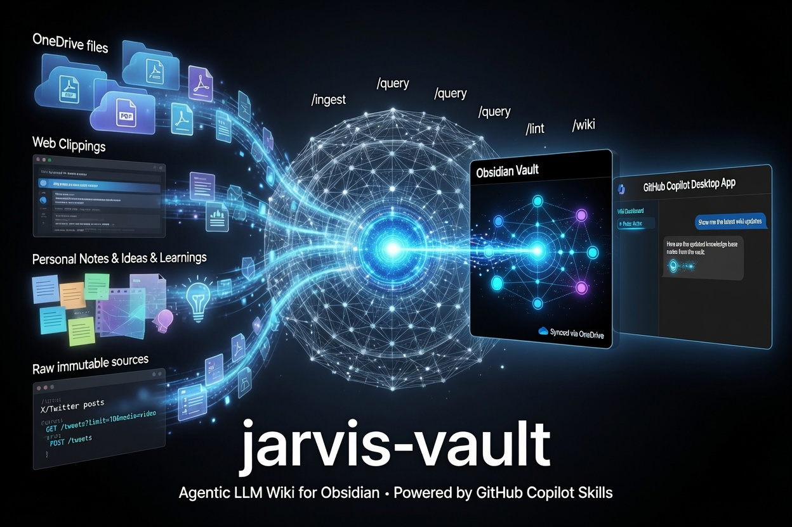

# jarvis-vault



Personal knowledge base using [Andrej Karpathy's LLM Wiki](https://gist.github.com/karpathy/442a6bf555914893e9891c11519de94f).

The LLM incrementally builds and maintains a persistent, interlinked wiki from immutable raw sources. You curate inputs and ask questions; the agent summarizes, cross-references, and keeps the wiki current.

The wiki itself lives in an external Obsidian vault (resolved via `WIKI_VAULT`). This repo holds the agentic skills, the deterministic engine, and the templates that populate that vault consistently.

## Why jarvis-vault

The things worth remembering — articles, threads, docs, meeting notes, research — arrive faster than anyone can file them. Bookmarks pile up unread, notes rot in folders, and search hands back a list of links instead of an answer. jarvis-vault turns that incoming stream into a living, interlinked knowledge base that an agent keeps current for you, so months later you can ask a plain question and get a synthesized, cited answer.

The project follows one data lifecycle in three phases:

| Phase | What happens | Who drives it |
|-------|--------------|---------------|
| **Capture** | Save a source into `raw/` with minimal friction — clip a page in the browser, hand the agent a URL, or import your X likes. Sources are immutable inputs. | You |
| **Ingest** | The agent folds each source into the wiki: a summary page, entity and concept pages, cross-links to what you already have, and explicit notes where sources disagree. | The agent |
| **Retrieve** | Ask questions in plain language. The agent answers with citations back to wiki pages and files durable answers — comparisons, analyses — back into the vault. | You + the agent |

Capture is the front door: the lifecycle only works if getting a source in is effortless, which is why the wiki supports [browser clipping](docs/obsidian/README.md), a one-line `wiki-add <url>`, and pasted-text drops alongside the connectors.

### Who it is for

- **Developers** drink from a firehose of engineering sources — papers, RFCs, changelogs, X threads, vendor docs. jarvis-vault becomes a second brain that cross-references them: capture a link as you read, let ingest connect it to related concepts, and later ask "what have I read about vector databases" to get a synthesized answer with sources instead of a bookmark graveyard.
- **Business users** track competitors, market moves, customer reports, and meeting notes. Capture the reports and articles as they land; ingest builds an entity page per company or product that stays current and flags where two sources contradict; querying produces side-by-side comparisons you can file and revisit.
- **Parents and households** — with a little technical comfort — collect recipes, school announcements, product research, pediatric advice, and trip plans. Clip them while browsing on any device that syncs the vault; the agent organizes and links them; months later ask "which car seat did that review recommend" and get the answer without re-reading everything.

## Three layers

| Layer | Where |
|-------|-------|
| Raw sources | `raw/` in the vault (sibling of the wiki) — immutable; agent reads only |
| The wiki | the external Obsidian vault at `WIKI_VAULT` — agent-maintained markdown |
| The schema | `AGENTS.md` — structure and workflows |

## Setup

The deterministic engine is mandatory however you drive it: the skills and the MCP server resolve your vault from `WIKI_VAULT`. You need [uv](https://docs.astral.sh/uv/) (the Python toolchain), Python 3.12+ (uv can install it), and a folder to hold the wiki — ideally an [Obsidian](https://obsidian.md/) vault, though any directory works.

| Requirement | Why |
|-------------|-----|
| [uv](https://docs.astral.sh/uv/) | Runs every console script; `bin/setup.sh` installs it on consent |
| Python 3.12+ | Engine runtime (uv installs a managed build if needed) |
| A vault folder | Holds `wiki/` and its `raw/` sibling |

You install one way, then interact another. The three paths below get the engine and skills onto your machine; after that you drive the wiki through an interaction surface — the GitHub Copilot desktop app, the Copilot CLI, or VS Code — all reading the same vault. For newcomers the recommended combination is **install path 1** (clone + `bin/setup.sh`) paired with the **desktop app** as your interaction surface — see [Interaction surfaces](#interaction-surfaces) below.

Install paths:

1. **Clone and run setup (recommended).** One idempotent script detects your toolchain, seeds the vault, builds the index, and prints the commands to install the skill plugins and register the MCP server:

   ```bash
   git clone https://github.com/erikschlegel/jarvis-vault.git
   cd jarvis-vault
   bash bin/setup.sh
   ```

2. **Install as a Copilot plugin.** Get the skills with `copilot plugin install` (see [below](#install-as-a-copilot-plugin)), then complete the engine setup with `bin/setup.sh` or the manual steps.

3. **Add to an existing checkout.** Run `uv sync`, copy `.env.example` to `.env` and set `WIKI_VAULT`, then `uv run wiki-init`. Verify any time with `uv run wiki-doctor`.

See [SETUP.md](SETUP.md) for the full walkthrough: requirements, the manual path, MCP registration for the GitHub Copilot CLI and VS Code, and troubleshooting mapped to `wiki-doctor`.

The engine is files-first and degrades gracefully: even without the MCP server, every wiki page is plain markdown you can read and edit directly, and the `wiki-search` CLI covers retrieval. See the access tiers in [AGENTS.md](AGENTS.md) for the full files → CLI → MCP progression.

For the X (Twitter) connector — API credentials, fetching likes and bookmarks, local video transcription — continue with the [wiki-connector-x setup](plugins/wiki-connector-x/README.md#setup).

## Interaction surfaces

Installing the engine and skills is one axis; how you *drive* the wiki is another. Once setup is done, you interact through one of three surfaces — all reading the same vault, so you can switch between them freely.

| Surface | Slash-commands | Best for |
|---------|----------------|----------|
| [GitHub Copilot desktop app](https://github.com/features/ai/github-app) | No — the installed skills surface automatically | Newcomers: the friendliest chat canvas over the vault |
| [Copilot CLI](https://docs.github.com/en/copilot/how-tos/set-up/install-copilot-cli) | Yes — `/wiki`, `/ingest`, `/query`, `/lint`, and the rest | Terminal-driven work with explicit command control |
| VS Code | Through the bundled `jarvis-vault` MCP server | Editing wiki pages in the editor alongside chat |

The desktop app is the recommended surface for newcomers. It becomes your canvas over the Obsidian vault, where you ingest, query, and lint entirely in chat, and it runs the installed skills through its own bundled runtime — so no `copilot` binary is required to use them. It does not replace setup: the engine install (path 1 above) and a one-time `copilot plugin install` (via the standalone Copilot CLI) still happen at a terminal.

A good first move on any surface is to ask Copilot to check your setup. It runs `wiki-doctor` end to end and surfaces any configuration mismatch — `WIKI_VAULT` unset, an unseeded vault, a missing search index, an unregistered MCP server, or an uninstalled plugin — each with the exact remediation, so Copilot can apply the fix with you. In the Copilot CLI the `/wiki` command runs this same check directly. See [SETUP.md](SETUP.md#github-copilot-cli-and-desktop) for desktop registration and plugin install.

## Install as a Copilot plugin

The skills ship as installable GitHub Copilot plugins, declared in [.github/plugin/marketplace.json](.github/plugin/marketplace.json): `wiki-core` (the engine and its ingest/query/lint skills) and `wiki-connector-x` (the X pre-ingest skills, which depend on `wiki-core`).

From your terminal, register this repo as a plugin marketplace, then install the plugins:

```bash
copilot plugin marketplace add erikschlegel/jarvis-vault
copilot plugin install wiki-core@jarvis-vault
copilot plugin install wiki-connector-x@jarvis-vault
```

To install a plugin straight from its subdirectory without registering the marketplace first:

```bash
copilot plugin install erikschlegel/jarvis-vault:plugins/wiki-core
```

Inside an interactive `copilot` session the equivalents are `/plugin marketplace add erikschlegel/jarvis-vault` and `/plugin install wiki-core@jarvis-vault`. Manage installs with `copilot plugin list`, `copilot plugin update --all`, and `copilot plugin uninstall NAME`.

These `copilot` commands use the standalone [Copilot CLI](https://docs.github.com/en/copilot/how-tos/set-up/install-copilot-cli), a separate install from the desktop app. You need it **once** to materialize the skills into `~/.copilot/skills/`; the desktop app then surfaces them on relaunch through its own bundled runtime, with no `copilot` binary required to use them. That is why `wiki-doctor` reports a missing `copilot` as a warning, not a failure — it is needed for plugin install and refresh, not for day-to-day use.

Installing the plugins gives you the skills; the deterministic engine still resolves your vault from `WIKI_VAULT`, so complete the [Setup](#setup) steps regardless of how you install.

The plugins also register slash-commands you invoke explicitly. In the Copilot CLI they route to the matching skill; the desktop app has no slash-commands, so there the same skills surface automatically instead.

| Command | Plugin | What it does |
|---------|--------|--------------|
| `/wiki` | wiki-core | Orientation dashboard: runs `wiki-doctor`, shows the pulse, and lists the `wiki-plan` worklist |
| `/ingest [source \| all]` | wiki-core | Fold a source into the wiki — accepts a `raw/` source, a path/URL, or an attachment/pasted text block (auto-landed); with no argument it ingests the next pending source, or clusters the queue into batchable groups and presents that plan when several are pending; `all` drains the worklist in bounded batches |
| `/query <question>` | wiki-core | Answer a question against the wiki, with citations |
| `/lint [domain]` | wiki-core | Health-check the wiki and fix issues with approval |
| `/save [title]` | wiki-core | File the current durable answer into the vault's `comparisons/` |
| `/pending [domain]` | wiki-core | Read-only summary of the ingest worklist |
| `/setup` | wiki-core | Seed the vault (`wiki-init`), then verify with `wiki-doctor` |
| `/x-import [path]` | wiki-connector-x | Import X likes and bookmarks into `raw/` |
| `/x-transcribe` | wiki-connector-x | Backfill transcripts for caption-less X videos |

See [AGENTS.md](AGENTS.md#commands) for the canonical command reference.

## Workflow

The steps map onto the Capture → Ingest → Retrieve lifecycle above.

1. **Capture** — drop a source into `raw/`: clip a page with the [Obsidian Web Clipper](docs/obsidian/README.md), run `uv run wiki-add <url>`, or import X likes and bookmarks.
2. **Ingest** — tell the agent to ingest it (one source, or `/ingest all` to drain a backlog in bounded batches).
3. Browse the vault in Obsidian — graph view, links, `index.md`.
4. **Retrieve** — query the wiki; file durable answers into the vault's `comparisons/`.
5. Periodically ask the agent to **lint** the wiki.

## Skills

The engine and its skills ship as two plugins under [plugins/](plugins/), a uv workspace. Each plugin directory is also its Python package, so the deterministic scripts travel with the plugin. The agent loads the matching skill automatically based on your request.

| Skill | Plugin | Operation | What it does |
|-------|--------|-----------|--------------|
| [x-import](plugins/wiki-connector-x/skills/x-import/SKILL.md) | wiki-connector-x | Pre-ingest | Clip X likes and bookmarks into `raw/` (API, account archive, bookmarks JSON, or Web Clipper folder) |
| [x-transcribe](plugins/wiki-connector-x/skills/x-transcribe/SKILL.md) | wiki-connector-x | Pre-ingest | Backfill local ASR transcripts for caption-less X videos so their spoken content is ingestible |
| [wiki-ingest](plugins/wiki-core/skills/wiki-ingest/SKILL.md) | wiki-core | Ingest | Fold one `raw/` source into the wiki — summary, entities, concepts, overview, index, log — then rebuild the index |
| [wiki-query](plugins/wiki-core/skills/wiki-query/SKILL.md) | wiki-core | Query | Answer questions against the wiki via the `jarvis-vault` MCP retrieval tools, with citations |
| [wiki-lint](plugins/wiki-core/skills/wiki-lint/SKILL.md) | wiki-core | Lint | Health-check the wiki — broken links, orphans, contradictions, stale claims, gaps — and fix with approval |

Typical chain: **x-import** → **x-transcribe** → **wiki-ingest** → **wiki-query**, with **wiki-lint** run periodically.

The engine exposes console entry points (`wiki-plan`, `wiki-pages`, `wiki-search`, `wiki-verify`, `wiki-mcp`; `x-fetch`, `x-import`, `x-refresh-streams`, `x-transcribe`) — run any with `uv run <entry-point>`. Vault and index locations resolve from `WIKI_VAULT` / `WIKI_INDEX_DIR` / `WIKI_STATE` / `WIKI_CONFIG`; see [AGENTS.md](AGENTS.md) for defaults.

## Obsidian vault

The wiki lives in your external Obsidian vault — markdown on disk, git for history. Obsidian is the IDE; the LLM is the programmer; the wiki is the codebase. Point `WIKI_VAULT` at the vault's wiki root, and seed a fresh vault from the structure template in [plugins/wiki-core/templates/vault/](plugins/wiki-core/templates/vault/) (see the [wiki-core README](plugins/wiki-core/README.md) for the bootstrap command). The vault's `index.md` is the catalog and `log.md` the timeline. New to Obsidian? Install it from [obsidian.md](https://obsidian.md/) and follow the official [getting-started guide](https://help.obsidian.md/Getting+started) to create your first vault.

Raw sources live in the vault alongside the wiki (`raw/`, a sibling of the wiki root, with attachments under `raw/assets/`).

See [docs/llm-wiki.md](docs/llm-wiki.md) for Karpathy's full pattern description.
